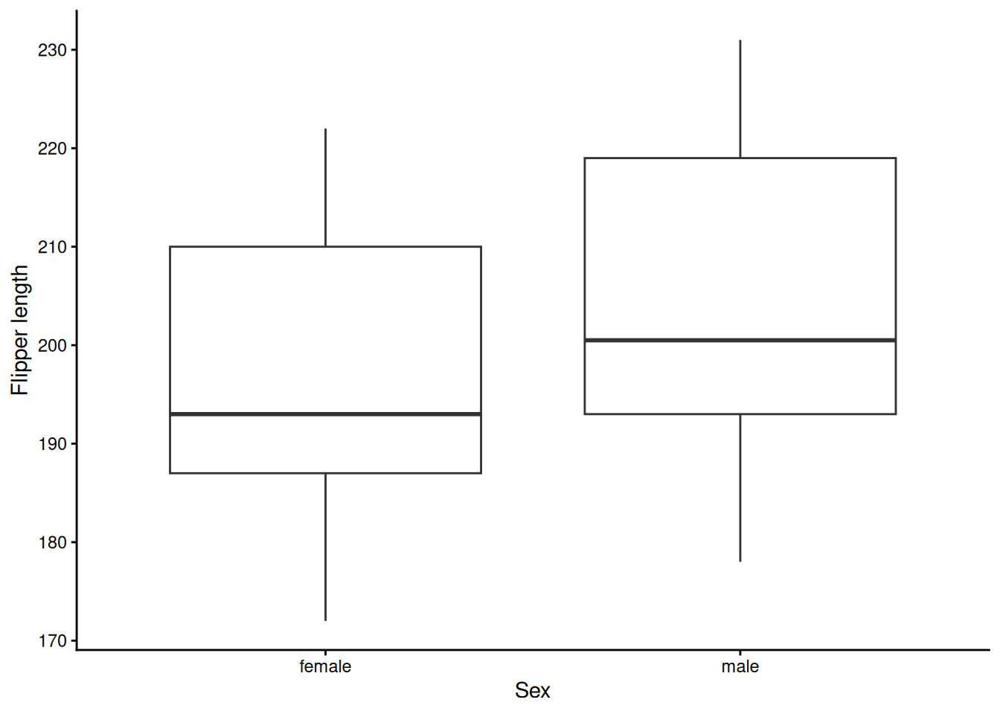
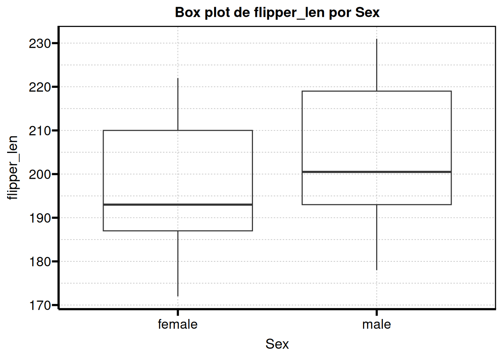
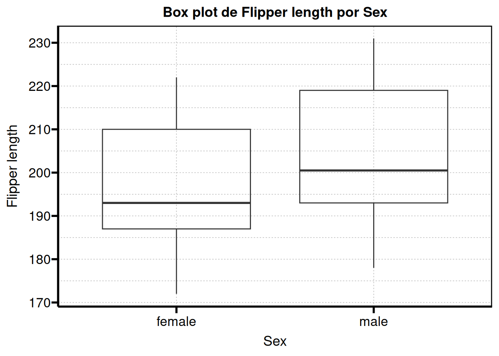

# Using BiVariAn

``` r
library(BiVariAn)
```

Using BiVariAn solves several different problems, each one described in
its corresponding function.

## Functions

There are currently several groups of functions available:

**Database oriented**

- `encode_factors`

- `fix_mixed_cols`

**Plotting oriented**

- `theme_serene`

- `theme_serene_void`

- `auto_bar_categ`

- `auto_bar_cont`

- `auto_viol_cont`

- `auto_bp_cont`

- `auto_corr_cont`

- `auto_dens_cont`

- `auto_pie_categ`

**Univariate and bivariate analyses**

- `auto_shapiro_raw`

- `dichotomous_2k_2sid`

- `continuous_2g`

- `continuous_2g_pair`

- `continuous_corr_test`

- `continuous_multg`

- `continuous_multg_rm`

**Regression analyses**

- `step_bw_p`

- `step_bw_firth`

- `logistf_summary`

- `ss_multreg`

## Usage examples

Suppose we want to start an analysis of a dataset with a large number of
variables. Typically, we would have to run normality tests, which would
mean writing one line of code for every variable. As an example, we will
use the `penguins` dataset available in the palmerpenguins package.

``` r
data(penguins)

dat <- penguins
```

### Normality

If we inspect the dataset we have 8 variables with 344 observations.
Among these variables there are 5 numeric variables (one of them
representing years), which would mean writing normality test code for
each of them.

``` r
shapiro.test(dat$bill_len)
#> 
#>  Shapiro-Wilk normality test
#> 
#> data:  dat$bill_len
#> W = 0.97485, p-value = 1.12e-05
```

More advanced users might consider writing a loop or using helper
functions such as `lapply` to evaluate all variables through a list (or
similar approaches).

``` r
cont_var <- c("bill_len", "bill_dep", "flipper_len", "body_mass")

lapply(dat[cont_var], function(x) shapiro.test(x))
#> $bill_len
#> 
#>  Shapiro-Wilk normality test
#> 
#> data:  x
#> W = 0.97485, p-value = 1.12e-05
#> 
#> 
#> $bill_dep
#> 
#>  Shapiro-Wilk normality test
#> 
#> data:  x
#> W = 0.97258, p-value = 4.419e-06
#> 
#> 
#> $flipper_len
#> 
#>  Shapiro-Wilk normality test
#> 
#> data:  x
#> W = 0.95155, p-value = 3.54e-09
#> 
#> 
#> $body_mass
#> 
#>  Shapiro-Wilk normality test
#> 
#> data:  x
#> W = 0.95921, p-value = 3.679e-08
```

With BiVariAn we can solve this problem (and improve the display of the
results) by using the `auto_shapiro_raw` function.

``` r
auto_shapiro_raw(data = dat)
```

| Variable    | p_shapiro | Normality  |
|-------------|-----------|------------|
| bill_len    | \<0.001\* | Non-normal |
| bill_dep    | \<0.001\* | Non-normal |
| flipper_len | \<0.001\* | Non-normal |
| body_mass   | \<0.001\* | Non-normal |
| year        | \<0.001\* | Non-normal |

Do we want a data frame instead of a flextable? We can do that with the
`flextableformat` argument (which is used in most functions).

``` r
shapirores <- auto_shapiro_raw(
  data = dat, 
  flextableformat = FALSE
)

shapirores
#>                Variable p_shapiro  Normality
#> bill_len       bill_len   <0.001* Non-normal
#> bill_dep       bill_dep   <0.001* Non-normal
#> flipper_len flipper_len   <0.001* Non-normal
#> body_mass     body_mass   <0.001* Non-normal
#> year               year   <0.001* Non-normal
```

### Bivariate analyses

After checking normality, the next natural step is to apply bivariate
tests, but again we would have to write separate code for each test. For
example, if we wanted to compare variables across sexes, we would write
something like this for every variable.

> **Note**
>
> The normality analysis showed a non normal distribution, so ideally at
> this stage we would not apply parametric tests. For now, we will
> continue as if we needed to perform a t test, only to illustrate the
> workflow.

``` r
# First we would evaluate homoscedasticity
car::leveneTest(
  dat$bill_len, 
  group = dat$sex,
  center = "median"
)
#> Levene's Test for Homogeneity of Variance (center = "median")
#>        Df F value  Pr(>F)  
#> group   1  2.8244 0.09378 .
#>       331                  
#> ---
#> Signif. codes:  0 '***' 0.001 '**' 0.01 '*' 0.05 '.' 0.1 ' ' 1

# Then we apply the t test
t.test(dat$bill_len)
#> 
#>  One Sample t-test
#> 
#> data:  dat$bill_len
#> t = 148.78, df = 341, p-value < 2.2e-16
#> alternative hypothesis: true mean is not equal to 0
#> 95 percent confidence interval:
#>  43.34125 44.50261
#> sample estimates:
#> mean of x 
#>  43.92193
```

Doing this for every variable quickly becomes an iterative and
repetitive process, and in addition we would need to write separate code
to report mean differences with their corresponding tests.

With BiVariAn we can avoid this by using the `continuous_2g` function.

``` r
continuous_2g(
  data = dat,
  groupvar = "sex"
)
```

| Variable    | P_Shapiro_Resid | P_Levene | P_T_Test  | Var_Equal | P_Mann_Whitney | Diff_Means | CI_Lower | CI_Upper | Significant_test |
|-------------|-----------------|----------|-----------|-----------|----------------|------------|----------|----------|------------------|
| bill_len    | \<0.001\*       | 0.09     | \<0.001\* | true      | \<0.001\*      | -3.76      | -4.87    | -2.65    | Mann-W-U test    |
| bill_dep    | \<0.001\*       | 0.69     | \<0.001\* | true      | \<0.001\*      | -1.47      | -1.86    | -1.07    | Mann-W-U test    |
| flipper_len | \<0.001\*       | 0.04     | \<0.001\* | false     | \<0.001\*      | -7.14      | -10.06   | -4.22    | Mann-W-U test    |
| body_mass   | \<0.001\*       | 0.01     | \<0.001\* | false     | \<0.001\*      | -683.41    | -840.58  | -526.25  | Mann-W-U test    |
| year        | \<0.001\*       | 1.00     | 0.99323   | true      | 0.99373        | 0.00       | -0.17    | 0.18     | None             |

#### Customizing the output

Similarly, we can use the `flextableformat` argument to obtain a data
frame.

``` r
continuous_2g(
  data = dat,
  groupvar = "sex",
  flextableformat = FALSE
)
#>      Variable P_Shapiro_Resid P_Levene P_T_Test Var_Equal P_Mann_Whitney
#> 1    bill_len         <0.001*  0.09378  <0.001*      TRUE        <0.001*
#> 2    bill_dep         <0.001*  0.68955  <0.001*      TRUE        <0.001*
#> 3 flipper_len         <0.001*  0.04011  <0.001*     FALSE        <0.001*
#> 4   body_mass         <0.001*  0.01435  <0.001*     FALSE        <0.001*
#> 5        year         <0.001*  0.99834  0.99323      TRUE        0.99373
#>   Diff_Means   CI_Lower   CI_Upper Significant_test
#> 1   -3.75779   -4.86656   -2.64903    Mann-W-U test
#> 2   -1.46562   -1.86021   -1.07103    Mann-W-U test
#> 3   -7.14232  -10.06481   -4.21982    Mann-W-U test
#> 4 -683.41180 -840.57826 -526.24533    Mann-W-U test
#> 5    0.00076   -0.17478    0.17630             None
```

However, we can also add labels to the variables using the
[`table1::label()`](https://rdrr.io/pkg/table1/man/label.html) function
from the `table1` package.

``` r
library(table1)
#> 
#> Attaching package: 'table1'
#> The following objects are masked from 'package:base':
#> 
#>     units, units<-

table1::label(dat$sex)        <- "Sex"
table1::label(dat$bill_len)   <- "Bill length"
table1::label(dat$bill_dep)   <- "Bill depth"
```

And we obtain a nicely labeled table.

``` r
continuous_2g(
  data = dat,
  groupvar = "sex"
)
```

| Variable    | P_Shapiro_Resid | P_Levene | P_T_Test  | Var_Equal | P_Mann_Whitney | Diff_Means | CI_Lower | CI_Upper | Significant_test |
|-------------|-----------------|----------|-----------|-----------|----------------|------------|----------|----------|------------------|
| Bill length | \<0.001\*       | 0.09     | \<0.001\* | true      | \<0.001\*      | -3.76      | -4.87    | -2.65    | Mann-W-U test    |
| Bill depth  | \<0.001\*       | 0.69     | \<0.001\* | true      | \<0.001\*      | -1.47      | -1.86    | -1.07    | Mann-W-U test    |
| flipper_len | \<0.001\*       | 0.04     | \<0.001\* | false     | \<0.001\*      | -7.14      | -10.06   | -4.22    | Mann-W-U test    |
| body_mass   | \<0.001\*       | 0.01     | \<0.001\* | false     | \<0.001\*      | -683.41    | -840.58  | -526.25  | Mann-W-U test    |
| year        | \<0.001\*       | 1.00     | 0.99323   | true      | 0.99373        | 0.00       | -0.17    | 0.18     | None             |

Do we want a title row that indicates the grouping variable? We can add
it with the `caption` argument.

``` r
continuous_2g(
  data = dat,
  groupvar = "sex",
  caption = TRUE
)
```

| Sex         |                 |          |           |           |                |            |          |          |                  |
|-------------|-----------------|----------|-----------|-----------|----------------|------------|----------|----------|------------------|
| Variable    | P_Shapiro_Resid | P_Levene | P_T_Test  | Var_Equal | P_Mann_Whitney | Diff_Means | CI_Lower | CI_Upper | Significant_test |
| Bill length | \<0.001\*       | 0.09     | \<0.001\* | true      | \<0.001\*      | -3.76      | -4.87    | -2.65    | Mann-W-U test    |
| Bill depth  | \<0.001\*       | 0.69     | \<0.001\* | true      | \<0.001\*      | -1.47      | -1.86    | -1.07    | Mann-W-U test    |
| flipper_len | \<0.001\*       | 0.04     | \<0.001\* | false     | \<0.001\*      | -7.14      | -10.06   | -4.22    | Mann-W-U test    |
| body_mass   | \<0.001\*       | 0.01     | \<0.001\* | false     | \<0.001\*      | -683.41    | -840.58  | -526.25  | Mann-W-U test    |
| year        | \<0.001\*       | 1.00     | 0.99323   | true      | 0.99373        | 0.00       | -0.17    | 0.18     | None             |

> **Important**
>
> To use the `caption` argument it is mandatory that `flextableformat`
> is TRUE; otherwise an error will be raised.

### Graphical representation

The next step would be to create graphical representations. Again, if we
want to use `ggplot2` we would write separate code for every plot (which
implies multiple lines of code that can become tedious if we want
extensive customization).

Let us create a boxplot to represent the comparison of `flipper_len`
across the `sex` variable.

``` r
library(tidyr)
library(dplyr)
#> 
#> Attaching package: 'dplyr'
#> The following objects are masked from 'package:stats':
#> 
#>     filter, lag
#> The following objects are masked from 'package:base':
#> 
#>     intersect, setdiff, setequal, union
library(ggplot2)
```

``` r
dat_comp <- dat %>% 
  drop_na(sex) # We remove the NAs from the sex variable

ggplot(
  data = dat_comp,
  mapping = aes(
    x = sex,
    y = flipper_len
  )
) + 
  geom_boxplot() + 
  labs(
    x = "Sex",
    y = "Flipper length"
  ) + 
  theme_classic()
```



Repeating this for every variable implies multiple lines of code. For
this reason, the `auto_bp_cont` function can help streamline the
workflow.

We simply call the function and store its output in an object. This
object is a list, so we can select the specific plot we want to display
or include in our report.

``` r
graphs <- auto_bp_cont(
  data = dat_comp, 
  groupvar = "sex"
)

graphs$flipper_len
```



If you remember, we previously assigned labels using
[`table1::label()`](https://rdrr.io/pkg/table1/man/label.html). The good
news is that these labels can also be used for the plots.

``` r
table1::label(dat_comp$sex)         <- "Sex"
table1::label(dat_comp$flipper_len) <- "Flipper length"

graphs <- auto_bp_cont(
  data = dat_comp, 
  groupvar = "sex"
)

graphs$flipper_len
```



At this point we have everything we need to build our report.

### Special mentions

As a special mention, there are some useful helper functions for
regression analysis. For example, the `step_bw_p` function helps with
the tedious iterative process of simplifying regression models by
stepwise backward selection based on a p value threshold, and the
`step_bw_firth` function performs the same process for models fitted
with
[`logistf::logistf()`](https://rdrr.io/pkg/logistf/man/logistf.html).

If we fit a model with our dataset, we obtain something like this:

``` r
model_reg <- glm(
  sex ~ species + island + bill_len + bill_dep + flipper_len + body_mass, 
  data = dat, 
  family = binomial()
)

step_bw_p(model_reg)
#> 
#> Initial model: sex ~ species + island + bill_len + bill_dep + flipper_len + body_mass 
#> Analysis of Deviance Table (Type II tests)
#> 
#> Response: sex
#>             LR Chisq Df Pr(>Chisq)    
#> species       32.685  2  7.991e-08 ***
#> island         1.061  2     0.5882    
#> bill_len      32.923  1  9.588e-09 ***
#> bill_dep      35.316  1  2.803e-09 ***
#> flipper_len    0.304  1     0.5815    
#> body_mass     50.238  1  1.362e-12 ***
#> ---
#> Signif. codes:  0 '***' 0.001 '**' 0.01 '*' 0.05 '.' 0.1 ' ' 1
#> 
#> Removing island (p = 0.5882)
#> Analysis of Deviance Table (Type II tests)
#> 
#> Response: sex
#>             LR Chisq Df Pr(>Chisq)    
#> species       31.895  2  1.186e-07 ***
#> bill_len      33.097  1  8.769e-09 ***
#> bill_dep      34.748  1  3.752e-09 ***
#> flipper_len    0.189  1     0.6638    
#> body_mass     51.667  1  6.575e-13 ***
#> ---
#> Signif. codes:  0 '***' 0.001 '**' 0.01 '*' 0.05 '.' 0.1 ' ' 1
#> 
#> Removing flipper_len (p = 0.6638)
#> Analysis of Deviance Table (Type II tests)
#> 
#> Response: sex
#>           LR Chisq Df Pr(>Chisq)    
#> species     32.590  2  8.378e-08 ***
#> bill_len    33.727  1  6.343e-09 ***
#> bill_dep    36.486  1  1.538e-09 ***
#> body_mass   58.852  1  1.700e-14 ***
#> ---
#> Signif. codes:  0 '***' 0.001 '**' 0.01 '*' 0.05 '.' 0.1 ' ' 1
#> 
#> No eliminable terms above p_threshold. Stopping.
#> $final_model
#> 
#> Call:  glm(formula = sex ~ species + bill_len + bill_dep + body_mass, 
#>     family = binomial(), data = dat)
#> 
#> Coefficients:
#>      (Intercept)  speciesChinstrap     speciesGentoo          bill_len  
#>       -76.093935         -6.897694         -7.875212          0.620082  
#>         bill_dep         body_mass  
#>         1.643613          0.005962  
#> 
#> Degrees of Freedom: 332 Total (i.e. Null);  327 Residual
#>   (11 observations deleted due to missingness)
#> Null Deviance:       461.6 
#> Residual Deviance: 127.3     AIC: 139.3
#> 
#> $steps
#>            Step
#> 1       Initial
#> 2      - island
#> 3 - flipper_len
#>                                                                    Formula
#> 1 "sex ~ species + island + bill_len + bill_dep + flipper_len + body_mass"
#> 2          "sex ~ species + bill_len + bill_dep + flipper_len + body_mass"
#> 3                        "sex ~ species + bill_len + bill_dep + body_mass"
#> 
#> attr(,"class")
#> [1] "step_bw"
```

In practice, this removes the need to manually perform three backward
selection steps (which would otherwise require typing the full model
each time or using helpers such as `reformulate`).

We can also store the output in an object:

``` r
step_res <- step_bw_p(
  model_reg, 
  trace = FALSE # To avoid printing the process in the console
)

step_res$steps       # Data frame of the steps involved
#>            Step
#> 1       Initial
#> 2      - island
#> 3 - flipper_len
#>                                                                    Formula
#> 1 "sex ~ species + island + bill_len + bill_dep + flipper_len + body_mass"
#> 2          "sex ~ species + bill_len + bill_dep + flipper_len + body_mass"
#> 3                        "sex ~ species + bill_len + bill_dep + body_mass"
step_res$final_model # Final model after all iterations
#> 
#> Call:  glm(formula = sex ~ species + bill_len + bill_dep + body_mass, 
#>     family = binomial(), data = dat)
#> 
#> Coefficients:
#>      (Intercept)  speciesChinstrap     speciesGentoo          bill_len  
#>       -76.093935         -6.897694         -7.875212          0.620082  
#>         bill_dep         body_mass  
#>         1.643613          0.005962  
#> 
#> Degrees of Freedom: 332 Total (i.e. Null);  327 Residual
#>   (11 observations deleted due to missingness)
#> Null Deviance:       461.6 
#> Residual Deviance: 127.3     AIC: 139.3
```
